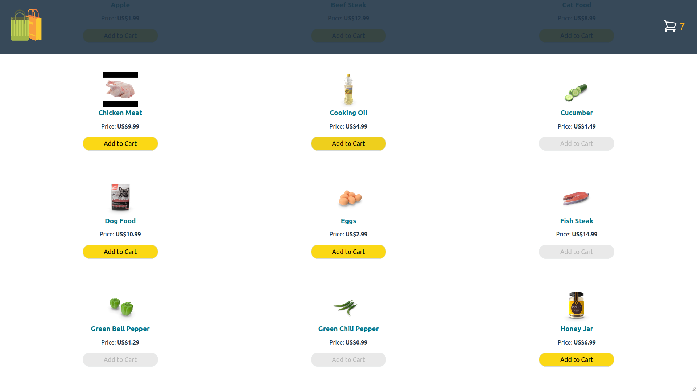
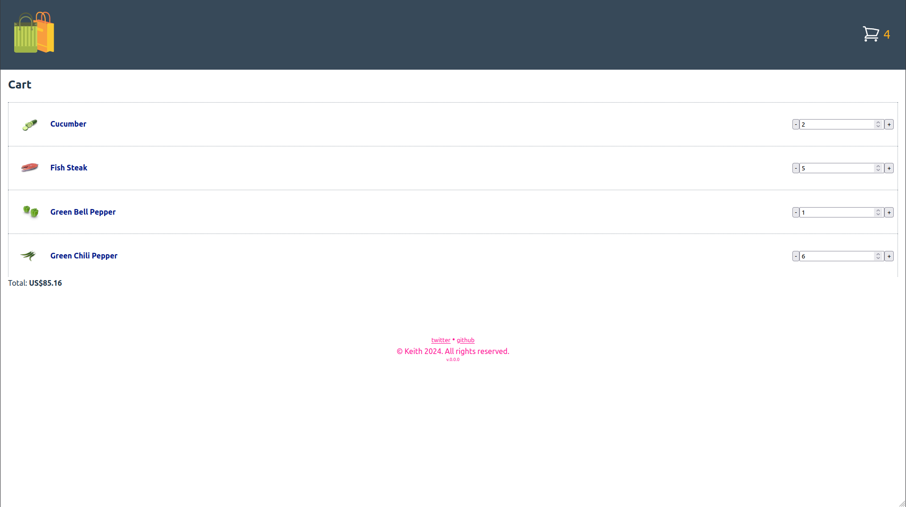

# reactTypescriptShoppingCart

<!--  -->

## Learnings

- Implemented a third-party REST API
- Work with React's useLocalState to store data within the browser
- Create components for each function that work together

## Future Plans:
- Add a login
- Add a payment processor
- ???

## Instructions to run locally (debian env)

In your terminal:
1. `cd shopping-cart`
2. `npm run dev`
3. `http://localhost:5173/`
